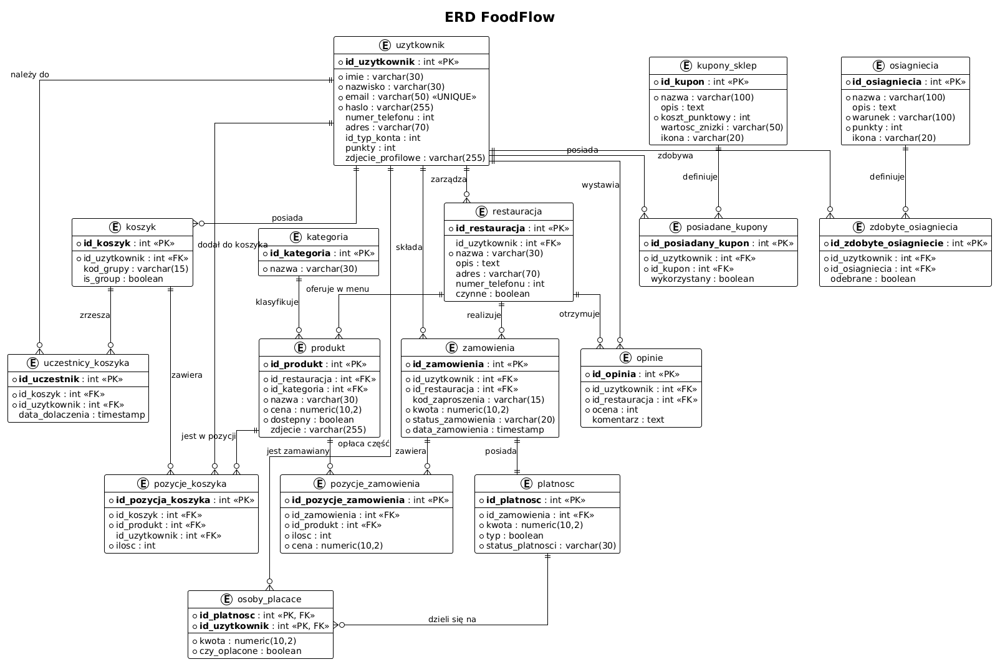
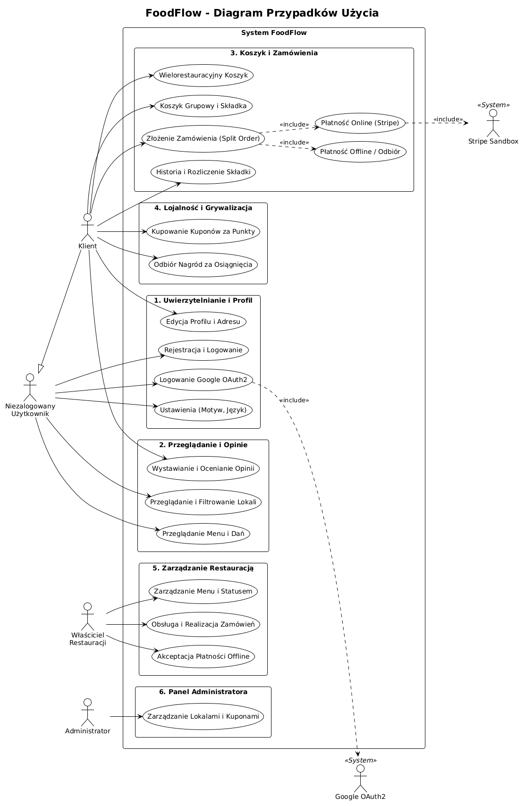

# FoodFlow - Projekt

### **Wykorzystywane Technologie**

#### **Frontend**
- React
- TypeScript
- Vite
- Axios
- i18next
- Vitest

#### **Backend**
- Python
- FastAPI
- SQLAlchemy
- Pydantic
- Uvicorn
- Pytest
- Psycopg2
- Stripe
- Passlib (PBKDF2)

#### **Baza Danych**
- PostgreSQL

## **Uruchomienie FoodFlow**

### Baza danych
Stworzyć bazę danych dla użytkownika `postgres` o nazwie `foodflow`, następnie kliknąć prawym na tą bazę, wybrać opcje `restore`, a następnie użyć pliku `baza.sql` jako przywracanie.


### Backend
```bash
cd foodflow_isi
pip install -r requirements.txt
uvicorn main:app --reload --host 127.0.0.1 --port 8000
```
### Testy
```bash
cd foodflow_isi
python -m pytest --cov=./ --cov-report=term-missing
```

### Frontend
```bash
cd Frontend
npm install
npm run dev
```

### Testy
```bash
cd Frontend
npx vitest run --coverage
```

## Logowanie na admina
```
Login: admin@admin.com
Hasło: admin
```

## **Diagramy**

### Schemat ERD


### Diagram Przypadków Użycia
